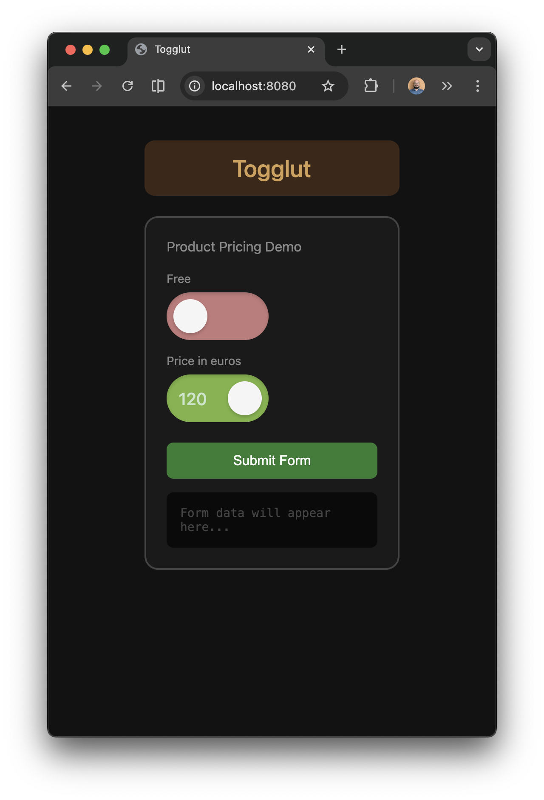

# Togglut

A Web Component that combines a toggle switch with a number input. Perfect for "free vs paid" pricing scenarios.



## Features

- Toggle OFF (red): Disabled state, no input visible
- Toggle ON (green): Enabled state, editable number input
- Native form integration via `ElementInternals`
- Keyboard accessible (Tab, Space/Enter)
- Zero dependencies

## Installation

Copy `togglut.js` to your project and include it:

```html
<script src="togglut.js"></script>
```

Or use ES modules:

```html
<script type="module">
  import './togglut.js';
</script>
```

## Usage

```html
<!-- Basic usage (starts OFF) -->
<togglut-input name="price" value="0"></togglut-input>

<!-- Starts ON with value -->
<togglut-input name="price" value="120" enabled></togglut-input>

<!-- In a form -->
<form>
  <togglut-input name="price" value="50"></togglut-input>
  <button type="submit">Submit</button>
</form>
```

## Attributes

| Attribute  | Type    | Description                    |
|------------|---------|--------------------------------|
| `name`     | string  | Form field name                |
| `value`    | number  | Numeric value                  |
| `enabled`  | boolean | Toggle state (on/off)          |
| `disabled` | boolean | Disable the component          |

## Properties

| Property  | Type    | Description                    |
|-----------|---------|--------------------------------|
| `value`   | number  | Get/set the numeric value      |
| `enabled` | boolean | Get/set the toggle state       |
| `name`    | string  | Get/set the form field name    |

## Events

### `change`

Fired when the toggle state or value changes.

```javascript
element.addEventListener('change', (e) => {
  console.log(e.detail.enabled); // boolean
  console.log(e.detail.value);   // number or null
});
```

## Form Integration

Togglut works with native HTML forms:

```javascript
const form = document.querySelector('form');
form.addEventListener('submit', (e) => {
  e.preventDefault();
  const data = new FormData(form);
  console.log(data.get('price')); // "120" or "0"
});
```

- **Toggle ON**: Submits the numeric value
- **Toggle OFF**: Submits "0"

## Styling

The component uses Shadow DOM. You can style external parts using CSS custom parts:

```css
togglut-input::part(container) {
  /* Style the toggle track */
}

togglut-input::part(input) {
  /* Style the number input */
}
```

## Browser Support

Works in all modern browsers that support:
- Custom Elements v1
- Shadow DOM v1
- `ElementInternals` (form-associated custom elements)

## Credits

This component was imagined while working with [@mattoleon](https://github.com/mattoleon) on the Cocobrico project.

## License

MIT
